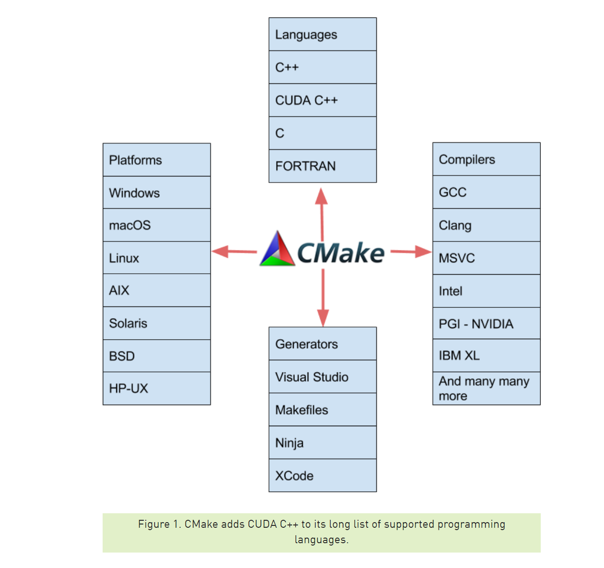

# CMake 编写 CUDA 应用程序
从cmake 3.9版本开始，cmake就原生支持了cuda c/c++。再这之前，是通过find_package(CUDA REQUIRED)来间接支持cuda c/c++的。这种写法不仅繁琐而且丑陋。所以这里主要介绍3.9版本之后引入的方法，cuda c/c++程序可以使用和普通的c/c++程序完全一样的操作，甚至两者可以混合使用，非常的方便，清晰明了。

本文便通过一个例子（矩阵乘法运算）来具体讲解。

## 准备工作
#### 安装cuda driver与cuda toolkit
具体参考nvidia官方文档，这里不再赘述。
安装完成后测试nvcc命令是否可以正常运行
```bash
nvcc --version
```
如果不能正常运行，将cudatoolkit下的bin目录加入到环境变量中（linux下通常为/usr/local/cuda/bin）

## 开启CUDA支持的选项
想要cmake支持.cu文件的编译，需要在CMakeLists.txt中开启CUDA的支持选项
```cmake
project(CUDA_MAT_MUL LANGUAGES CXX CUDA)
```
如果需要编译选项支持是否开启cuda支持(即cuda为可选项)，也可以使用如下方法
```cmake
project(CUDA_MAT_MUL)
if(CUDA_ENABLE)
    enable_language(CUDA)
endif()
```
你可以像往常一样添加一个库
```
add_library(cudaMatMul cudaMatMul.cu cudaMatMul.h)
target_compile_features(cudaMatMul PUBLIC cxx_std_11)
```
可以链接到普通的c++程序中
```
add_executable(main main.cc)
target_link_libraries(main cudaMatMul)
```

## 引入cuda依赖库
如果我们想引入英伟达官方或者第三方的cuda库时，我们也可以编写一个供find_package调用的模块。这里以引入cublas库为例，新建一个FindcuBLAS.cmake（参考Github [CLblast](https://github.com/CNugteren/CLBlast/blob/master/cmake/Modules/FindcuBLAS.cmake)）
```cmake
# ==================================================================================================
# This file is part of the cuBLASt project. The project is licensed under Apache Version 2.0. This
# project loosely follows the Google C++ styleguide and uses a tab-size of two spaces and a max-
# width of 100 characters per line.
#
# Author(s):
#   Cedric Nugteren <www.cedricnugteren.nl>
#
# ==================================================================================================
#
# Defines the following variables:
#   CUBLAS_FOUND          Boolean holding whether or not the cuBLAS library was found
#   CUBLAS_INCLUDE_DIRS   The CUDA and cuBLAS include directory
#   CUDA_LIBRARIES        The CUDA library
#   CUBLAS_LIBRARIES      The cuBLAS library
#
# In case CUDA is not installed in the default directory, set the CUDA_ROOT variable to point to
# the root of cuBLAS, such that 'cublas_v2.h' can be found in $CUDA_ROOT/include. This can either be
# done using an environmental variable (e.g. export CUDA_ROOT=/path/to/cuBLAS) or using a CMake
# variable (e.g. cmake -DCUDA_ROOT=/path/to/cuBLAS ..).
#
# ==================================================================================================

# Sets the possible install locations
set(CUBLAS_HINTS
  ${CUDA_ROOT}
  $ENV{CUDA_ROOT}
  $ENV{CUDA_TOOLKIT_ROOT_DIR}
)
set(CUBLAS_PATHS
  /usr
  /usr/local
  /usr/local/cuda
)

# Finds the include directories
find_path(CUBLAS_INCLUDE_DIRS
  NAMES cublas_v2.h cuda.h
  HINTS ${CUBLAS_HINTS}
  PATH_SUFFIXES include inc include/x86_64 include/x64
  PATHS ${CUBLAS_PATHS}
  DOC "cuBLAS include header cublas_v2.h"
)
mark_as_advanced(CUBLAS_INCLUDE_DIRS)

# Finds the libraries
find_library(CUDA_LIBRARIES
  NAMES cudart
  HINTS ${CUBLAS_HINTS}
  PATH_SUFFIXES lib lib64 lib/x86_64 lib/x64 lib/x86 lib/Win32 lib/import lib64/import
  PATHS ${CUBLAS_PATHS}
  DOC "CUDA library"
)
mark_as_advanced(CUDA_LIBRARIES)
find_library(CUBLAS_LIBRARIES
  NAMES cublas
  HINTS ${CUBLAS_HINTS}
  PATH_SUFFIXES lib lib64 lib/x86_64 lib/x64 lib/x86 lib/Win32 lib/import lib64/import
  PATHS ${CUBLAS_PATHS}
  DOC "cuBLAS library"
)
mark_as_advanced(CUBLAS_LIBRARIES)

# ==================================================================================================

# Notification messages
if(NOT CUBLAS_INCLUDE_DIRS)
    message(STATUS "Could NOT find 'cuBLAS.h', install CUDA/cuBLAS or set CUDA_ROOT")
endif()
if(NOT CUDA_LIBRARIES)
    message(STATUS "Could NOT find CUDA library, install it or set CUDA_ROOT")
endif()
if(NOT CUBLAS_LIBRARIES)
    message(STATUS "Could NOT find cuBLAS library, install it or set CUDA_ROOT")
endif()

# Determines whether or not cuBLAS was found
include(FindPackageHandleStandardArgs)
find_package_handle_standard_args(cuBLAS DEFAULT_MSG CUBLAS_INCLUDE_DIRS CUDA_LIBRARIES CUBLAS_LIBRARIES)

# ==================================================================================================
```
当我们编写需要依赖cublas库的程序时便可以这样写
```cmake
find_package(cuBLAS)
add_executable(cublasMatMul cublasMatMul.cu)
target_compile_features(cublasMatMul PRIVATE cxx_std_11)
target_link_libraries(cublasMatMul PRIVATE ${CUBLAS_LIBRARIES})
```
完全和编写普通c++程序一样的体验，非常棒。